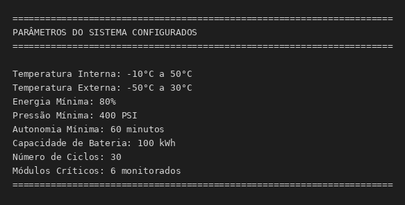
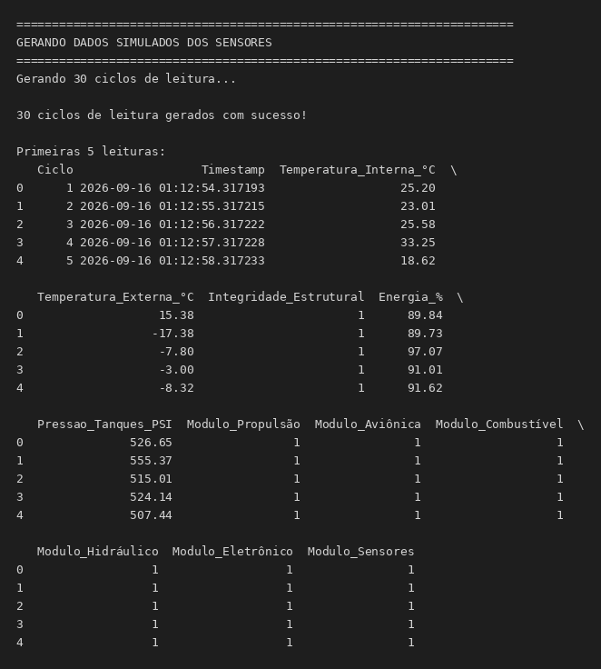
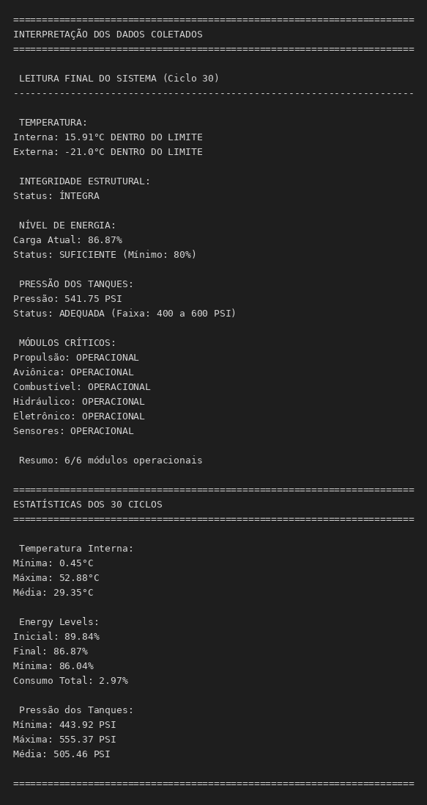
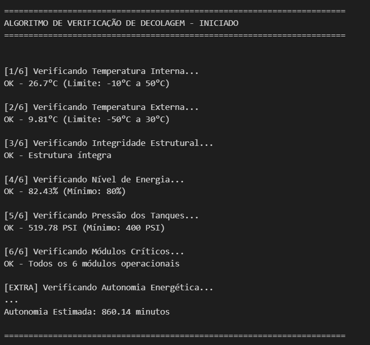
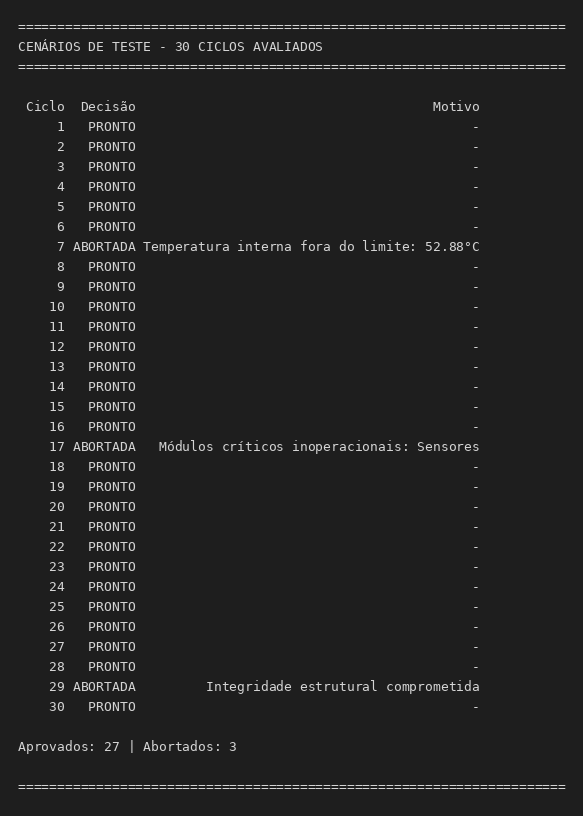
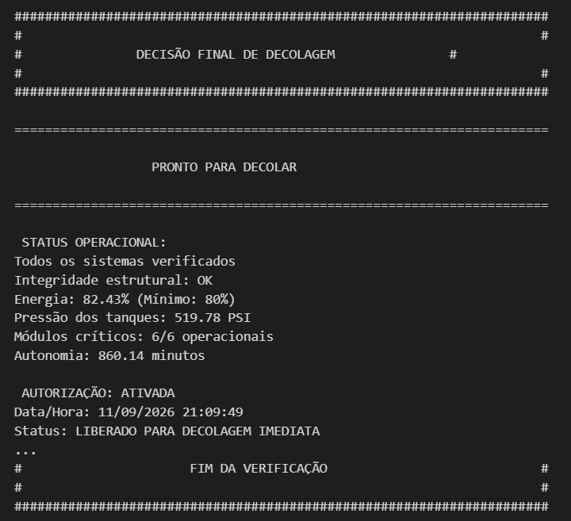
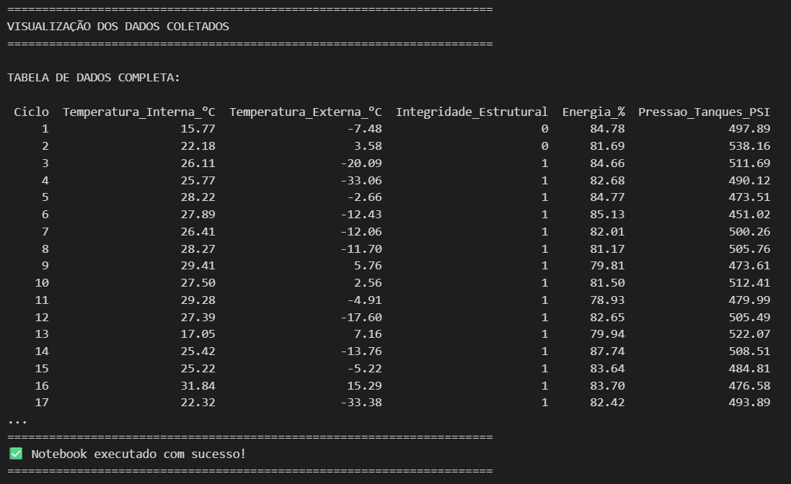

# Sistema de Verificação de Decolagem - Simulador Aeroespacial

## Descrição do Projeto

Este projeto implementa um **sistema automatizado de verificação de decolagem** para veículos aeroespaciais/drones. O sistema coleta dados de sensores, valida a integridade estrutural, verifica níveis de energia e calcula autonomia energética antes de autorizar a decolagem.

### Componentes Principais

#### 1. **Geração de Dados Simulados**
- Simula leitura de sensores reais de uma aeronave
- Gera dados aleatórios com distribuição realista
- Armazena em um DataFrame Pandas para análise

#### 2. **Interpretação de Dados**
O sistema monitora:
- **Temperatura Interna**: Faixa operacional (-10°C a 50°C)
- **Temperatura Externa**: Variação atmosférica (-50°C a 30°C)
- **Integridade Estrutural**: Verificação binária (1=Íntegro, 0=Danificado)
- **Níveis de Energia**: Porcentagem de carga da bateria (0-100%)
- **Pressão dos Tanques**: PSI/Bar (pressão de combustível/fluidos)
- **Status de Módulos Críticos**: 6 módulos verificados (Propulsão, Aviônica, Combustível, Hidráulico, Eletrônico, Sensores)

#### 3. **Algoritmo de Verificação de Decolagem**
Implementa múltiplas camadas de verificação:
- Verificação de Temperatura
- Verificação de Integridade Estrutural
- Verificação de Energia
- Verificação de Pressão
- Verificação de Módulos Críticos
- Verificação de Autonomia Energética

**Resultado Final**: "PRONTO PARA DECOLAR" ou "DECOLAGEM ABORTADA"

```
INÍCIO

    // Leitura dos dados de telemetria
    LER temperatura_interna
    LER temperatura_externa
    LER integridade_estrutural
    LER nivel_energia
    LER pressão_tanques
    LER status_modulos_criticos

    // Verificação de Temperatura Interna
    SE temperatura_interna > 50 OU temperatura_interna < -10
     ENTÃO resultado = "DECOLAGEM ABORTADA"

    // Verificação de Temperatura Externa
    SE temperatura_externa > 30 OU temperatura_externa < -50
     ENTÃO resultado = "DECOLAGEM ABORTADA"

    // Verificação de Integridade Estrutural
    SE integridade_estrutural == 0
     ENTÃO resultado = "DECOLAGEM ABORTADA"

    // Verificação de Energia
    SE nivel_energia < 80
     ENTÃO resultado = "DECOLAGEM ABORTADA"

    // Verificação de Pressão dos Tanques
    SE pressão_tanques < 400 OU pressão_tanques > 600
     ENTÃO resultado = "DECOLAGEM ABORTADA"

    // Verificação de Módulos Críticos
    PARA cada módulo em lista_modulos
     SE módulo == 0
      ENTÃO resultado = "DECOLAGEM ABORTADA"

    // Análise Energética
    energia_disponivel = (nivel_energia * capacidade_total) / 100
    consumo_total = potencia_decolagem + (potencia_decolagem * 0.15)
    autonomia = energia_disponivel / consumo_total
    margem = nivel_energia - energia_minima

    SE margem < 5
     ENTÃO estado_energia = "CRÍTICO"
     SENÃO estado_energia = "ADEQUADO"

    // Resultado Final
    SE todas_verificações == OK
     ENTÃO resultado = "PRONTO PARA DECOLAR"
     SENÃO resultado = "DECOLAGEM ABORTADA"

    // Recomendações Automáticas
    SE nivel_energia < 85
     MOSTRAR "Recomendação: recarregar antes da decolagem"
    SE estado_energia == "CRÍTICO"
     MOSTRAR "Alerta: margem de segurança reduzida"

IMPRIMIR resultado

FIM

```

#### 4. **Análise Energética**
Calcula a autonomia da aeronave considerando:
- Capacidade total da bateria (kWh)
- Carga atual (%)
- Consumo estimado na decolagem (W)
- Perdas energéticas (%)
- **Autonomia em minutos** até exaustão da bateria

## Como Executar

### Pré-requisitos
- Python 3.7+
- pip (gerenciador de pacotes Python)

### Instalação das Dependências

```bash
pip install -r requirements.txt
```

### Execução do Notebook

#### Opção 1: Jupyter Notebook (Recomendado)
```bash
jupyter notebook
```
Após abrir o Jupyter, navegue até a pasta e abra o arquivo `simulador_decolagem.ipynb`

#### Opção 2: JupyterLab
```bash
jupyter lab
```

#### Opção 3: Google Colab (Online)
1. Acesse [Google Colab](https://colab.research.google.com)
2. Faça upload do arquivo `.ipynb`
3. Execute as células

## Estrutura do Notebook

### Célula 1: Importações
- Carrega bibliotecas necessárias: pandas, numpy, random

### Célula 2: Configuração Inicial
- Define limites de operação
- Inicializa parâmetros do simulador

### Célula 3: Geração de Dados
- Cria múltiplos ciclos de leitura de sensores
- Simula variação realista dos valores
- Armazena em DataFrame

### Célula 4: Interpretação de Dados
- Exibe estatísticas dos dados coletados
- Mostra leitura dos sensores

### Célula 5: Algoritmo de Verificação
- Implementa loop de verificação
- Realiza todas as validações
- Toma decisão de decolagem/aborto

### Célula 6: Análise Energética
- Calcula consumo de energia
- Determina autonomia
- Exibe relatório energético

### Célula 7: Visualização de Resultados
- Exibe resumo executivo
- Mostra alertas e avisos
- Decisão final de decolagem

## Parâmetros Configuráveis

```python
# Limites de Temperatura (°C)
TEMP_INTERNA_MIN, TEMP_INTERNA_MAX = -10, 50
TEMP_EXTERNA_MIN, TEMP_EXTERNA_MAX = -50, 30

# Nível de Energia (%)
ENERGIA_MINIMA = 80  # Mínimo 80% para decolagem

# Pressão dos Tanques (PSI)
PRESSAO_MINIMA = 400

# Autonomia Mínima (minutos)
AUTONOMIA_MINIMA = 60

# Capacidade de Bateria (kWh)
CAPACIDADE_BATERIA = 100

# Consumo na Decolagem (W)
CONSUMO_DECOLAGEM = 5000

# Perdas Energéticas (%)
PERDAS_ENERGETICAS = 0.15
```

## Modificações e Personalizações

### Para alterar o número de ciclos de leitura:
```python
NUM_CICLOS = 50  # Aumentar para mais leituras
```

### Para modificar limites de segurança:
```python
ENERGIA_MINIMA = 75  # Abaixar limite de energia
AUTONOMIA_MINIMA = 30  # Reduzir autonomia mínima
```

### Para adicionar novos sensores:
1. Modifique a função `gerar_dados_sensores()`
2. Adicione validação no algoritmo de verificação
3. Atualize o critério final de decolagem

## Saída Esperada

```
=== SIMULADOR DE VERIFICAÇÃO DE DECOLAGEM ===

ESTATÍSTICAS DOS SENSORES:
Temperatura Interna: 25.3°C
Temperatura Externa: -5.2°C
Integridade Estrutural: 100% - ÍNTEGRA
Nível de Energia: 92%
Pressão dos Tanques: 450 PSI
Status Módulos Críticos: 6/6 OPERACIONAL

ANÁLISE ENERGÉTICA:
Capacidade Total: 100 kWh
Carga Atual: 92 kWh (92%)
Consumo na Decolagem: 5000 W
Autonomia Estimada: 92.8 minutos
Perdas Energéticas: 15%

RESULTADO FINAL: PRONTO PARA DECOLAR
```

## Prints das execuções







```

## Critérios de Aborto

A decolagem será **ABORTADA** se:
- Estrutura comprometida (integridade = 0)
- Energia < 80%
- Pressão dos tanques < 400 PSI
- Algum módulo crítico inoperante
- Autonomia estimada < 60 minutos
- Temperatura fora dos limites operacionais

## Bibliotecas Utilizadas

- **pandas**: Manipulação e análise de dados
- **numpy**: Computação numérica
- **random**: Geração de dados aleatórios
- **datetime**: Timestamps e timing

## Conceitos de Aprendizagem

Este projeto demonstra:
- Manipulação de dados com Pandas
- Operações numéricas com NumPy
- Lógica condicional e loops
- Análise de dados para tomada de decisão
- Simulação de sistemas reais
- Tratamento de erros e validação

## Suporte

Para dúvidas sobre a execução:
1. Verifique se todas as dependências estão instaladas: `pip install -r requirements.txt`
2. Verifique a versão do Python: `python --version`
3. Certifique-se de estar no diretório correto
4. Execute célula por célula para identificar erros

## Licença

Projeto educacional FIAP - Fase 1 Atividade

---

**Última Atualização**: Setembro 2026
**Versão**: 1.0
